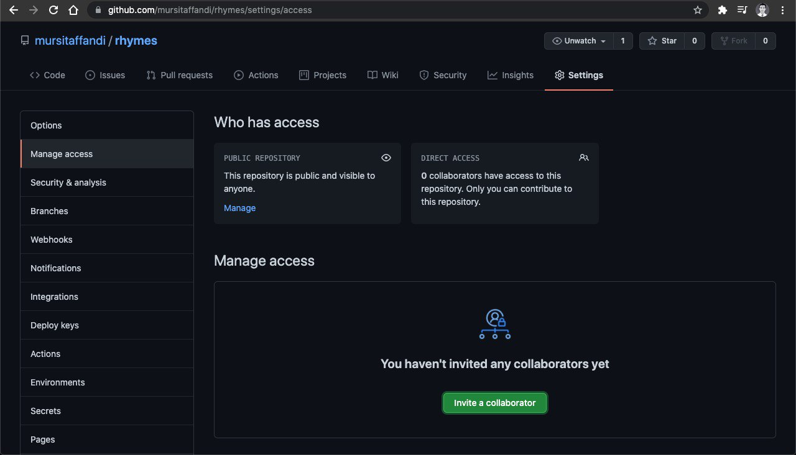
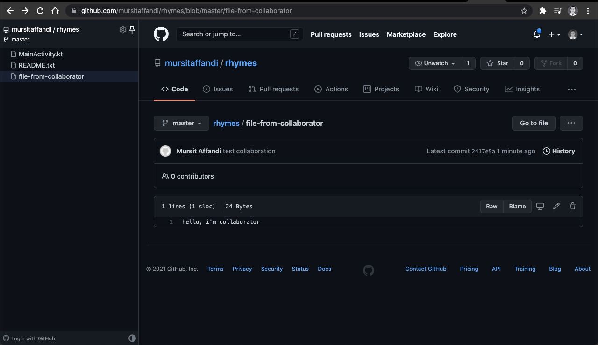

buka halaman kolaborasi 
https://github.com/mursitaffandi/rhymes/settings/access

cari akun kolaborator

copy link invitation dan berikan ke kolaborator agar dia dapat menyetujuinya

di akun kolaborator, bisa langsung menyetujui ajakan dari akun yg mengajaknya kolaborasi

dari kompoter kolaborator, buka terminal, dan ikuti langkah berikut

affandis-MacBook-Pro:sittokp affandimursit$ git clone git@github.com:mursitaffandi/rhymes.git
Cloning into 'rhymes'...
Warning: Permanently added the RSA host key for IP address '52.74.223.119' to the list of known hosts.
remote: Enumerating objects: 9, done.
remote: Counting objects: 100% (9/9), done.
remote: Compressing objects: 100% (6/6), done.
remote: Total 9 (delta 0), reused 9 (delta 0), pack-reused 0
Receiving objects: 100% (9/9), 26.02 KiB | 6.50 MiB/s, done.

affandis-MacBook-Pro:sittokp affandimursit$ cd rhymes/

affandis-MacBook-Pro:rhymes affandimursit$ ls
MainActivity.kt	README.txt

affandis-MacBook-Pro:rhymes affandimursit$ touch file-from-collaborator

affandis-MacBook-Pro:rhymes affandimursit$ echo "hello, i'm collaborator" >> file-from-collaborator 

affandis-MacBook-Pro:rhymes affandimursit$ cat file-from-collaborator 
hello, i'm collaborator

affandis-MacBook-Pro:rhymes affandimursit$ git add .

affandis-MacBook-Pro:rhymes affandimursit$ git commit -m "test collaboration"
[master 2417e5a] test collaboration
 1 file changed, 1 insertion(+)
 create mode 100644 file-from-collaborator
affandis-MacBook-Pro:rhymes affandimursit$ git push
Enumerating objects: 4, done.
Counting objects: 100% (4/4), done.
Delta compression using up to 4 threads
Compressing objects: 100% (2/2), done.
Writing objects: 100% (3/3), 361 bytes | 361.00 KiB/s, done.
Total 3 (delta 0), reused 0 (delta 0), pack-reused 0
To github.com:mursitaffandi/rhymes.git
   4b0dde2..2417e5a  master -> master

affandis-MacBook-Pro:rhymes affandimursit$ 

hasil kolaborasi

